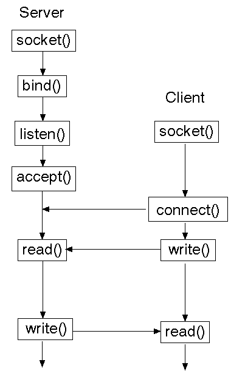

> (c) http://www.it.uom.gr/teaching/distrubutedSite/dsIdaLiu/labs/lab2_1/sockets.html

# vide
Exemplo de comunicação entre processos no modelo R-R _(request-reply)_ estilo _client-server_ via TCP.

A typical scenario is as follows:
1. The server process is started on some computer system. It initializes itself, then goes to sleep waiting for a client process to contact it requesting some service.

2. A client process is started, either on the same system or on another system that is connected to the server's system with a network. The client process sends a request across the network to the server requesting a service of some form.
3. When the server process has finished providing its service to the client, the server goes back to sleep, waiting for the next client request to arrive.


[]()

## build & run

```bash
make ## compilar
./server 6789 & ## deixar o server em background
netstat -lnt ## verificar estado
./client 'mensagem' ## enviar para o server
```

## types
- [`struct sockaddr_in`](https://www.gta.ufrj.br/ensino/eel878/sockets/sockaddr_inman.html)
- [`struct hostent`](https://www.gnu.org/software/libc/manual/html_node/Host-Names.html)

## functions
name | params | return  | description
:----|:-------|:--------|:-----------
[`gethostbyname`](https://www.gta.ufrj.br/ensino/eel878/sockets/gethostbynameman.html) | `const char *name` or <br> `const char *addr, int len, int type` | `struct hostent *` | Get an IP address for a hostname, or vice-versa
[`bzero`](http://man7.org/linux/man-pages/man3/bzero.3.html) | `void *s, size_t n` | `void` |  Erases the data in the n bytes of the memory starting at the location pointed to by s, by writing zeroes (bytes containing '\0') to that area
[`htons`](https://www.gta.ufrj.br/ensino/eel878/sockets/htonsman.html) | `uint16_t hostshort` | `uint16_t` | Convert multi-byte integer types from host byte order to network byte order; host to network short
[`htonl`](https://www.gta.ufrj.br/ensino/eel878/sockets/htonsman.html) | `uint32_t hostshort` | `uint32_t` | Convert multi-byte integer types from host byte order to network byte order; host to network long
[`socket`](http://man7.org/linux/man-pages/man2/socket.2.html) | `int domain, int type, int protocol` | `int` | Create an endpoint for communication; file descriptor
[`connect`](http://man7.org/linux/man-pages/man2/connect.2.html) | `int sockfd, const struct sockaddr *addr, socklen_t addrlen` | `int` | Initiate a connection on a socket
[`bind`](http://man7.org/linux/man-pages/man2/bind.2.html) | `int sockfd, const struct sockaddr *addr, socketlen addrlen` | `int` | Bind a name to a socket
[`accept`](http://man7.org/linux/man-pages/man2/accept.2.html) | `int sockfd, struct sockaddr *addr, socklen_t *addrlen` | `int` | Accept a connection on a socket
[`listen`](https://linux.die.net/man/2/listen) | `int sockfd, int backlog` | `int` | Listen for connections on a socket
[`send`](http://man7.org/linux/man-pages/man2/sendmsg.2.html) | `int sockfd, const void *buf, size_t len, int flags` | `ssize_t` | Send a message on a socket
[`recv`](http://man7.org/linux/man-pages/man2/recvmsg.2.html) | `int sockfd, void *buf, size_t len, int flags` | `ssize_t` | Receive a message from a socket
[`write`](http://man7.org/linux/man-pages/man2/write.2.html) | `int fd, const void *buf, size_t count` | `ssize_t` | Write to a file descriptor
[`read`](http://man7.org/linux/man-pages/man2/read.2.html) | `int fd, void *buf, size_t count` | `ssize_t` | Read from a file descriptor
[`close`](http://man7.org/linux/man-pages/man2/close.2.html) | `int fd` | `int` | Close a file descriptor