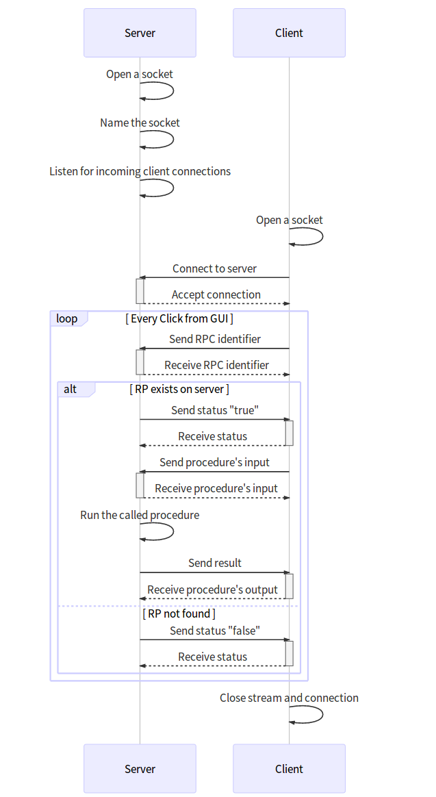

## vide
Dois programas (_client_ e _server_) para demonstrar uma RPC que computa a soma ou multiplicação de 2 números.
O programa servidor atende a mais de 1 cliente, criando uma thread por conexão.
Assim, devido à fila de sockets em espera, os demais clientes que estabelecerem uma conexão, não poderão enviar suas informações no canal de comunicação (_stream_) aberto até que o anterior feche a conexão.

- a conexão é estabelecida através de **sockets stream** (sob o modelo TCP) a fim de manter um canal de comunicação confiável e segura entre os dois _hosts_ remotos;
- os procedimentos remotos são identificados por um número do tipo `short` (16 bits, i.e., de **-32.768** a **32.767**).

[](./docs/diagrams/sequence-diagram1.mmd)
> diagram build with [MermaidJS](https://mermaidjs.github.io)

```
.
├── makefile
└── src
    ├── client
    │   ├── ClientSocketController.java
    │   └── TelaPrincipal.java              [main]
    ├── server
    │   ├── ConnectionProtocol.java
    │   ├── InfoLog.java
    │   ├── RemoteProcedure.java
    │   └── ServerSocketController.java     [main]
    └── shared
        └── RPCMetaData.java
```

## build & run

```bash
make && cd build
java server.ServerSocketController &
java client.TelaPrincipal

netstat -lnt6 ## verificar estado da conexão tcp6

## apagar objetos
cd .. && make clean
```